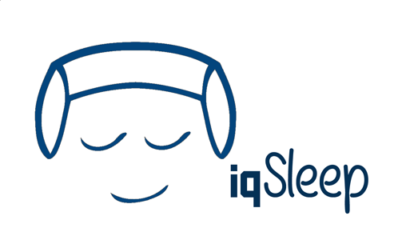
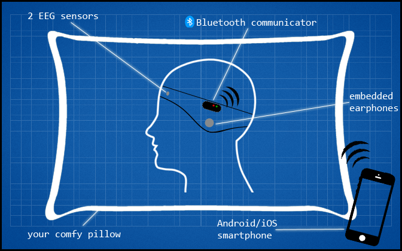
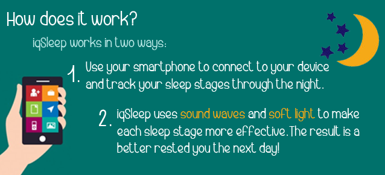

iqSleep is a sleep enhancement band that uses EEG for sleep recognition and binaural beats for brain entrainment.
In this repo you'll find a prototyped algorithm for sleep recognition and entrainment, meant to be used in the development of iqSleep, a headband for sleep enhancement. 

